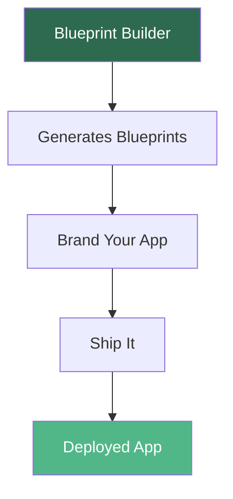

<Info>
**Core System 1 of 3** — An AI-powered blueprint generator that turns your app idea into a complete 8-section build plan
</Info>

## What This Does

You describe an app idea in plain English. The Blueprint Builder generates a complete 8-section blueprint — identical in structure to every pre-built blueprint in the library. Same format. Same depth. Your idea.

<CardGroup cols={2}>
  <Card title="Input" icon="comment">
    "I want to build a meditation timer for busy moms"
  </Card>
  <Card title="Output" icon="file-code">
    A full blueprint with features, user flow, design direction, starter code prompts, and monetization strategy — ready to build
  </Card>
</CardGroup>

## Why This Exists

The blueprint library has 32 pre-built app plans across 9 niches. But your best idea might not be in the library.

| Without the Builder | With the Builder |
|---------------------|------------------|
| Stare at a blank screen | Describe your idea in 2 sentences |
| Guess what features to include | Get a prioritized feature list |
| Skip the user flow | Get a step-by-step walkthrough |
| No design direction | Get colors, fonts, and layout guidance |
| Wing the code prompt | Get tested starter prompts for your level |
| No monetization plan | Get 3 income strategies with price ranges |

## How to Use It (5 Minutes)

<Steps>
  <Step title="Open Google AI Studio">
    Go to [aistudio.google.com](https://aistudio.google.com) and sign in with your Google account.
  </Step>
  
  <Step title="Create a New Chat">
    Click **"Create new"** → Select **"Chat"** → Choose **Gemini 2.0 Flash** as the model.
  </Step>
  
  <Step title="Paste the System Prompt">
    Open the Blueprint Builder Prompt file. Copy the ENTIRE contents. Paste it into the **System Instructions** box in AI Studio.
  </Step>
  
  <Step title="Describe Your App">
    In the chat input, type something like:
    
    ```
    I want to build an app that helps freelance photographers
    track their client bookings and send automatic reminders.
    My niche is wealth/business. I'm a beginner builder.
    ```
  </Step>
  
  <Step title="Get Your Blueprint">
    The AI generates a complete blueprint following the exact same 8-section format as every blueprint in the library.
  </Step>
  
  <Step title="Build It">
    Copy the starter prompt from your complexity level (Section 6), paste it into AI Studio, and start building.
  </Step>
</Steps>

## Blueprint Sections Generated

Every generated blueprint includes these 8 sections:

<AccordionGroup>
  <Accordion title="1. Header" icon="table">
    App code, name, tagline, niche, complexity, build time
  </Accordion>
  
  <Accordion title="2. The Vision" icon="eye">
    What it does + Consumer vs Alchemist contrast
  </Accordion>
  
  <Accordion title="3. Feature List" icon="list-check">
    Core features + stretch features
  </Accordion>
  
  <Accordion title="4. User Flow" icon="route">
    Step-by-step from the user's perspective
  </Accordion>
  
  <Accordion title="5. Design Direction" icon="palette">
    Colors, fonts, layout, mood
  </Accordion>
  
  <Accordion title="6. Vibe Coding Guide" icon="code">
    Starter prompts for Beginner, Intermediate, AND Advanced
  </Accordion>
  
  <Accordion title="7. Monetization Strategy" icon="dollar-sign">
    3 ways to make money from this app
  </Accordion>
  
  <Accordion title="8. Teaching Notes" icon="book-open">
    Prerequisites, common mistakes, where to get help
  </Accordion>
</AccordionGroup>

## Example Walkthrough

<Note>
**What you type:**

> I want to build a habit tracker for people trying to read more books. It should let them log pages read each day, set a daily goal, and show a streak counter. I'm in the personal development niche. I'm a beginner.
</Note>

**What you get back:**

A complete blueprint for **THE PAGE FORGE** (or similar branded name) including:

- 5 core features (daily page logger, goal setter, streak counter, book shelf, progress chart)
- 7-step user flow (open app → see today's goal → log pages → streak updates → etc.)
- Design direction pointing to the Personal Development niche palette
- A complete Beginner starter prompt ready to paste into AI Studio
- 3 monetization paths ($19 digital product, $149 custom build service, $9/mo SaaS)
- Teaching notes with common mistakes ("Don't try to add social features before the tracker works")

## Tips for Better Blueprints

<Tip>
**Be Specific About Your User**

- ❌ "A fitness app"
- ✅ "A workout tracker for busy parents who only have 20 minutes to exercise"
</Tip>

<Tip>
**State Your Niche**

The Builder maps your idea to one of 9 niche palettes. Tell it: Health, Wealth, Relationships, Personal Dev, Faith, Fitness, Parenting, Beauty, or Productivity
</Tip>

<Tip>
**State Your Level**

- **Beginner** — Never coded before. Want a single HTML file.
- **Intermediate** — Built 2-3 apps. Ready for multi-file projects and APIs.
- **Advanced** — Want user accounts, databases, and security.
</Tip>

<Tip>
**Iterate**

Your first blueprint is a starting point. Follow up with:
- "Add a social sharing feature to the stretch features"
- "Make the monetization section focus on selling to churches"
- "Simplify the Advanced path — I don't need Stripe integration"
</Tip>

## Prerequisites

Before using the Blueprint Builder, complete:

<CardGroup cols={2}>
  <Card title="Flash Module 01" icon="video" href="/blueprints/flash-modules">
    What Is Vibe Coding?
  </Card>
  <Card title="Flash Module 02" icon="video" href="/blueprints/flash-modules">
    AI Studio Setup
  </Card>
</CardGroup>

<Check>
Review at least 1 pre-built blueprint from the library to understand the format
</Check>

## Where This Fits



<CardGroup cols={3}>
  <Card title="Brand Your App" icon="paintbrush" href="/blueprints/brand-your-app">
    Niche palettes for design
  </Card>
  <Card title="Ship It" icon="rocket" href="/blueprints/ship-it">
    Deploy your app
  </Card>
  <Card title="App Blueprints" icon="book" href="/blueprints/niches/health-weight-loss">
    32 pre-built blueprints
  </Card>
</CardGroup>

## FAQ

<AccordionGroup>
  <Accordion title="Do I need the Builder if there's already a blueprint for my idea?">
    Use the pre-built one. The Builder is for ideas NOT in the library.
  </Accordion>
  
  <Accordion title="Can I modify a generated blueprint?">
    Yes. It's YOUR blueprint. Edit any section. The Builder gives you a starting point, not a final answer.
  </Accordion>
  
  <Accordion title="What if the Builder generates something weird?">
    Refine your description. Be more specific about the user, the problem, and the features you want. The better your input, the better your blueprint.
  </Accordion>
  
  <Accordion title="Can I use this for client work?">
    Yes. Generate a blueprint, customize it for the client's needs, build it, and charge for it. See Section 7 (Monetization) in any blueprint for pricing guidance.
  </Accordion>
</AccordionGroup>