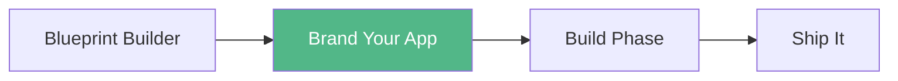

<Info>
**Core System 2 of 3** — Every niche has a visual language. This system gives you the exact colors, fonts, and design rules for your niche.
</Info>

## What This Does

Every niche has a visual language. Health apps look different from finance apps. Faith apps feel different from fitness apps. This system gives you the exact colors, fonts, and design rules for your niche — so your app looks professional without hiring a designer.

<CardGroup cols={2}>
  <Card title="Input" icon="comment">
    "I'm building a fitness app"
  </Card>
  <Card title="Output" icon="file-code">
    5 hex codes, 2 Google Fonts, icon style, layout guidance, design do's and don'ts — ready to paste into your code
  </Card>
</CardGroup>

## Why This Exists

| Without Brand Your App | With Brand Your App |
|------------------------|---------------------|
| Pick random colors that clash | Get a tested 5-color palette for your niche |
| Use whatever font looks cool | Get a Google Fonts pairing that works together |
| App looks like a homework assignment | App looks like it was designed by a professional |
| Waste 2 hours on design decisions | Copy-paste CSS variables and start building |

## The 9 Niche Palettes

Each palette file gives you everything you need to brand your app in under 5 minutes.

<CardGroup cols={3}>
  <Card title="Health & Weight Loss" icon="heart-pulse" color="#2D6A4F">
    Clean, natural, trustworthy
    
    **Primary:** Forest Core `#2D6A4F`
    
    **Fonts:** Nunito + Source Sans 3
  </Card>
  
  <Card title="Make Money & Wealth" icon="sack-dollar" color="#1B263B">
    Sophisticated, authoritative, premium
    
    **Primary:** Midnight Navy `#1B263B`
    
    **Fonts:** DM Serif Display + Inter
  </Card>
  
  <Card title="Relationships & Dating" icon="heart" color="#7B2D8E">
    Warm, elegant, inviting
    
    **Primary:** Rose Warmth `#7B2D8E`
    
    **Fonts:** Cormorant Garamond + Raleway
  </Card>
  
  <Card title="Personal Development" icon="brain" color="#FF6B35">
    Energetic, motivating, bold
    
    **Primary:** Ember Orange `#FF6B35`
    
    **Fonts:** Poppins + Work Sans
  </Card>
  
  <Card title="Faith-Based" icon="cross" color="#2C3E6B">
    Reverent, timeless, peaceful
    
    **Primary:** Sacred Navy `#2C3E6B`
    
    **Fonts:** Merriweather + Open Sans
  </Card>
  
  <Card title="Fitness & Body" icon="dumbbell" color="#D62828">
    Intense, powerful, action-driven
    
    **Primary:** Power Red `#D62828`
    
    **Fonts:** Oswald + Roboto
  </Card>
  
  <Card title="Parenting & Kids" icon="baby" color="#FF6F91">
    Playful, friendly, warm
    
    **Primary:** Sunshine Yellow `#F4A623`
    
    **Fonts:** Baloo 2 + Quicksand
  </Card>
  
  <Card title="Beauty & Skincare" icon="sparkles" color="#BC6C8A">
    Refined, soft, luxurious
    
    **Primary:** Rose Quartz `#BC6C8A`
    
    **Fonts:** Playfair Display + Lato
  </Card>
  
  <Card title="Productivity & Time" icon="clock" color="#023E8A">
    Sharp, focused, minimal
    
    **Primary:** Graphite Core `#023E8A`
    
    **Fonts:** Space Grotesk + Inter
  </Card>
</CardGroup>

## What's in Each Palette

Every palette file includes:

<Steps>
  <Step title="The 5-Color Palette">
    A table with hex codes and usage guidance:
    - **Primary** — Main buttons, headers, key interactive elements
    - **Secondary** — Supporting elements, hover states, secondary buttons
    - **Accent** — Highlights, success states, badges, callouts
    - **Background** — Page background, card surfaces
    - **Text** — Body text, headings, labels
  </Step>
  
  <Step title="Typography Pairing">
    Two Google Fonts that work together:
    - **Heading Font** — For titles, section headers, hero text
    - **Body Font** — For paragraphs, labels, descriptions
    - Includes weight recommendations and `<link>` tag ready to copy
  </Step>
  
  <Step title="CSS Custom Properties">
    A complete `:root` block you can drop into any project:
    ```css
    :root {
      --color-primary: #hex;
      --color-secondary: #hex;
      --color-accent: #hex;
      --color-background: #hex;
      --color-text: #hex;
      --font-heading: 'Font Name', sans-serif;
      --font-body: 'Font Name', sans-serif;
    }
    ```
  </Step>
  
  <Step title="Icon Style">
    Which icon approach works best for the niche (outlined, filled, emoji-based, or minimal line).
  </Step>
  
  <Step title="Design Do's and Don'ts">
    3-5 specific design rules for the niche — not generic advice, but things that matter for THIS audience.
  </Step>
</Steps>

## How to Use It (2 Minutes)

<Steps>
  <Step title="Pick Your Niche">
    Open the palette file that matches your app's niche from the cards above.
  </Step>
  
  <Step title="Copy the CSS Variables">
    Grab the CSS custom properties block and paste it at the top of your `styles.css` file (or inside a `<style>` tag for single-file apps).
  </Step>
  
  <Step title="Copy the Font Link">
    Paste the Google Fonts `<link>` tag into your HTML `<head>`.
  </Step>
  
  <Step title="Use the Variables">
    Reference your colors and fonts throughout your CSS:
    ```css
    body {
      background-color: var(--color-background);
      color: var(--color-text);
      font-family: var(--font-body);
    }
    
    h1, h2, h3 {
      font-family: var(--font-heading);
      color: var(--color-primary);
    }
    
    .btn-primary {
      background-color: var(--color-primary);
      color: white;
    }
    ```
  </Step>
  
  <Step title="Follow the Design Rules">
    Read the Do's and Don'ts for your niche. They take 30 seconds to read and prevent 2 hours of design mistakes.
  </Step>
</Steps>

## When to Use This

<CardGroup cols={2}>
  <Card title="Every New App" icon="plus">
    Pick the niche palette before writing a single line of code
  </Card>
  <Card title="With Blueprint Builder" icon="wand-magic-sparkles">
    The AI references these palettes when generating design direction
  </Card>
  <Card title="For Client Work" icon="briefcase">
    Use their niche palette as a starting point, then customize
  </Card>
  <Card title="When It Looks Off" icon="eye">
    Swap to the niche palette and watch it come together
  </Card>
</CardGroup>

## Example: Health & Weight Loss Palette

<Tabs>
  <Tab title="Colors">
    | Role | Color Name | Hex | Usage |
    |------|------------|-----|-------|
    | **Primary** | Forest Core | `#2D6A4F` | Main buttons, headers, navigation |
    | **Secondary** | Vitality Green | `#52B788` | Supporting elements, hover states |
    | **Accent** | Mint Glow | `#B7E4C7` | Highlights, success states, badges |
    | **Background** | Clean Slate | `#F0FFF4` | Page background, card surfaces |
    | **Text** | Deep Bark | `#1B4332` | Body text, headings, labels |
  </Tab>
  
  <Tab title="Typography">
    **Heading Font:** Nunito (Bold 700, ExtraBold 800)
    
    **Body Font:** Source Sans 3 (Regular 400, SemiBold 600)
    
    **Why it works:** Rounded, friendly, approachable — matches the "health is accessible" message
    
    ```html
    <link href="https://fonts.googleapis.com/css2?family=Nunito:wght@700;800&family=Source+Sans+3:wght@400;600&display=swap" rel="stylesheet">
    ```
  </Tab>
  
  <Tab title="CSS Variables">
    ```css
    :root {
      /* Health & Weight Loss Palette */
      --color-primary: #2D6A4F;
      --color-secondary: #52B788;
      --color-accent: #B7E4C7;
      --color-background: #F0FFF4;
      --color-text: #1B4332;
      
      /* Typography */
      --font-heading: 'Nunito', sans-serif;
      --font-body: 'Source Sans 3', sans-serif;
    }
    ```
  </Tab>
  
  <Tab title="Design Rules">
    **Do's:**
    - Use ample white space — Health apps should feel spacious and uncluttered
    - Make progress visual — Use green progress bars, circular meters
    - Use rounded corners (12-16px) — Soft shapes feel approachable
    
    **Don'ts:**
    - Don't use aggressive reds for calorie warnings — Use gentle amber instead
    - Don't overload dashboards — Show today's summary first
    - Don't use tiny text for nutrition data — Minimum 14px
  </Tab>
</Tabs>

## Where This Fits



<CardGroup cols={3}>
  <Card title="Blueprint Builder" icon="wand-magic-sparkles" href="/blueprints/blueprint-builder">
    Generate blueprints that reference these palettes
  </Card>
  <Card title="Ship It" icon="rocket" href="/blueprints/ship-it">
    Deploy your branded app
  </Card>
  <Card title="Niche Blueprints" icon="book" href="/blueprints/niches/health-weight-loss">
    Pre-built apps for each niche
  </Card>
</CardGroup>