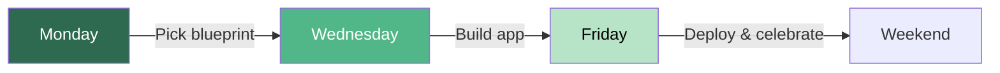

<Info>
**Cadence:** Monday / Wednesday / Friday every week

**Format:** Live on Skool + recorded for replays
</Info>

## The Weekly Build Cycle

Every week at Digital Alchemy is a complete build cycle. Not a lecture. Not a demo. A full arc from zero to deployed app — in five days.

<CardGroup cols={3}>
  <Card title="Monday" icon="calendar">
    Pick the blueprint, understand the plan
  </Card>
  <Card title="Wednesday" icon="code">
    Build the app live with AI assistance
  </Card>
  <Card title="Friday" icon="rocket">
    Deploy it, showcase it, celebrate it
  </Card>
</CardGroup>

The cycle works whether you're on week one or week ninety. Beginners pick Beginner-level blueprints. Experienced builders pick Intermediate or Advanced. Everyone builds. Everyone ships.

## The 3 Weekly Classes

<Tabs>
  <Tab title="Blueprint Monday">
    ### Blueprint Monday
    
    **Duration:** 60 minutes
    
    **Format:** Live workshop + group participation
    
    **What happens:**
    
    Blueprint Monday is strategy day. No code yet — just clarity. The instructor spotlights a specific niche, walks through a blueprint from the library in detail, and demonstrates the Blueprint Builder live. The group asks questions, critiques the structure, and gets a feel for the build ahead. At the end, the weekly build challenge is assigned.
    
    **Who it's for:** Everyone. Beginners select a Beginner path. Experienced builders choose Intermediate or Advanced. If you're unsure which level fits, Monday's walkthrough will make it obvious.
    
    **Outcome:** Every member leaves the session with a clear, specific build plan for the week. No ambiguity. No "I'm not sure what to make." You know exactly what you're building and why.
    
    <Steps>
      <Step title="Niche Spotlight (10 min)">
        Why this niche matters, who uses these apps, monetization potential
      </Step>
      <Step title="Blueprint Walkthrough (20 min)">
        Walk through featured blueprint section by section
      </Step>
      <Step title="Blueprint Builder Demo (15 min)">
        Live demo of generating a custom blueprint in this niche
      </Step>
      <Step title="Q&A + Weekly Challenge (15 min)">
        Answer questions, assign the weekly build challenge
      </Step>
    </Steps>
  </Tab>
  
  <Tab title="Vibe Coding Wednesday">
    ### Vibe Coding Wednesday
    
    **Duration:** 90 minutes
    
    **Format:** Live build session + screen share + real-time troubleshooting
    
    **What happens:**
    
    This is the main event. Wednesday is where the app gets built — live, in real-time, with the whole community watching and participating. The session opens with a quick recap of Monday's blueprint, then one Flash Concept is taught to fill a specific knowledge gap. From there, the instructor builds the app from scratch using Google AI Studio, narrating every decision, showing every prompt, and fixing every error in public.
    
    Member troubleshooting happens live in chat. Stuck on something? Drop it in chat. Hot seat spots are available for members to share their screen and get live debugging help.
    
    By the end of the session, the code is pushed to GitHub.
    
    **Who it's for:** Active builders. Show up with your blueprint open and your tools ready. This is a work session, not a webinar.
    
    **Outcome:** A working (or nearly working) app pushed to GitHub. Even if it is not perfect, it is real code that you built and understand.
    
    <Steps>
      <Step title="Blueprint Recap (10 min)">
        Review Monday's blueprint and this week's build goal
      </Step>
      <Step title="Flash Concept (15 min)">
        Teach one specific skill needed for today's build
      </Step>
      <Step title="Live Build Session (50 min)">
        Build the app from scratch with AI, narrating every step
      </Step>
      <Step title="Community Troubleshooting (10 min)">
        Answer live questions, debug member issues
      </Step>
      <Step title="Push to GitHub (5 min)">
        Commit code and push to repository
      </Step>
    </Steps>
  </Tab>
  
  <Tab title="Ship It Friday">
    ### Ship It Friday
    
    **Duration:** 60 minutes
    
    **Format:** Deployment workshop + showcase + community celebration
    
    **What happens:**
    
    Friday is the payoff. The session opens with a live deployment walkthrough — the week's app gets pushed to GitHub Pages or Vercel in front of everyone. Deployment issues get troubleshot in real-time (because deployment always has a surprise). Then the showcase begins: members share their live URLs, the community gives feedback, and the group votes for App of the Week. The session closes with the weekend stretch challenge for anyone who wants to level up before the next cycle.
    
    **Who it's for:** Everyone who built something this week. Incomplete apps are welcome. Half-finished apps are welcome. If you wrote code this week, you belong in this session.
    
    **Outcome:** Live deployed apps with real URLs. Community recognition. A completed build cycle. And a stretch challenge to carry momentum into the weekend.
    
    <Steps>
      <Step title="Live Deployment Demo (20 min)">
        Deploy this week's app to GitHub Pages or Vercel
      </Step>
      <Step title="Deployment Troubleshooting (10 min)">
        Fix common deployment errors in real-time
      </Step>
      <Step title="Community Showcase (20 min)">
        Members share live URLs, get feedback
      </Step>
      <Step title="App of the Week Vote (5 min)">
        Community votes on favorite app
      </Step>
      <Step title="Weekend Stretch Challenge (5 min)">
        Optional challenge to level up the build
      </Step>
    </Steps>
  </Tab>
</Tabs>

## Weekly Rhythm

The full week looks like this — three anchored sessions surrounded by independent build time:

| Day | Class | Duration | Energy | Focus |
|-----|-------|----------|--------|-------|
| **Monday** | Blueprint Monday | 60 min | Strategic | Plan + Learn |
| **Tuesday** | Independent work | — | Build | Start coding |
| **Wednesday** | Vibe Coding Wednesday | 90 min | Creative | Build + Debug |
| **Thursday** | Independent work | — | Polish | Refine + Test |
| **Friday** | Ship It Friday | 60 min | Celebratory | Deploy + Share |
| **Weekend** | Stretch Challenge | Optional | Experimental | Level up |

<Note>
Tuesday and Thursday are your independent build days. Use them. The classes give you the plan, the skills, and the push — but the reps happen when you are building on your own.
</Note>

## Niche Rotation

Classes rotate through all 9 Digital Alchemy niches over a 9-week cycle, then repeat. Each niche gets one full week.

| Week | Niche | Monday Blueprint | Recommended Build |
|------|-------|-----------------|-------------------|
| 1 | Health & Weight Loss | HW-01 or HW-02 | Macro Alchemist or Hydration Engine |
| 2 | Make Money & Wealth | WB-01 | Income Tracker |
| 3 | Relationships & Dating | RD-01 | Date Night Generator |
| 4 | Personal Development | PD-01 | Affirmation Engine |
| 5 | Faith-Based | FB-01 | Devotional Companion |
| 6 | Fitness & Body | FT-01 | Rep Counter |
| 7 | Parenting & Kids | PC-01 or PC-02 | Chore Quest or Storytime Forge |
| 8 | Beauty & Skincare | BS-01 | Skincare Routine Builder |
| 9 | Productivity | PT-01 | Focus Timer |

After 9 weeks, the rotation restarts at Intermediate level. Same niches, new blueprints, more complex builds. Then again at Advanced.

<Tip>
By the time you have been through all three rotations, you have built 27 apps across 9 different problem spaces.
</Tip>

## How to Prepare

<Tabs>
  <Tab title="Before Blueprint Monday">
    - Browse the Blueprint Index to see which blueprint is featured this week
    - Think about which niche resonates with you most
    - No technical prep required — come as you are
  </Tab>
  
  <Tab title="Before Vibe Coding Wednesday">
    - Google AI Studio open and ready ([studio.google.com](https://aistudio.google.com))
    - Monday's blueprint open
    - Code editor installed (VS Code recommended)
    - Flash Modules 01-03 completed if you're a beginner
    - GitHub account set up
    - Expect to type, experiment, and get stuck (that's normal)
  </Tab>
  
  <Tab title="Before Ship It Friday">
    - Code pushed to GitHub (or ready to push)
    - GitHub account active and verified
    - Vercel account set up if deploying Intermediate/Advanced
    - List of deployment issues you hit
    - Your live URL ready to share if already deployed
  </Tab>
</Tabs>

## Recording & Replay Policy

<CardGroup cols={2}>
  <Card title="All Classes Recorded" icon="video">
    Every session is automatically recorded and posted within 2 hours
  </Card>
  <Card title="No Expiration" icon="infinity">
    Access replays anytime, forever. No expiration windows.
  </Card>
  <Card title="Organized by Week" icon="folder">
    Naming: `Week-XX-Blueprint-Monday-[Topic].mp4`
  </Card>
  <Card title="Live Encouraged" icon="users">
    Live attendance is strongly encouraged for community energy and real-time troubleshooting
  </Card>
</CardGroup>

## Class Interaction

<CardGroup cols={2}>
  <Card title="Real-Time Chat" icon="message-square">
    Ask questions during the session — instructor answers live
  </Card>
  <Card title="Screen Sharing" icon="screen-share">
    1-2 members per session get "hot seat" debugging help
  </Card>
  <Card title="Moderated Focus" icon="shield">
    Chat is focused — build questions get priority
  </Card>
  <Card title="Small-Group Feel" icon="users">
    Intimate engagement even as community grows
  </Card>
</CardGroup>

<Tip>
If you have a question, ask it. If you're stuck, say so. The community learns most when problems are solved in public.
</Tip>

## Related Resources

<CardGroup cols={3}>
  <Card title="Blueprint Library" icon="book" href="/blueprints/niches/health-weight-loss">
    32 pre-built blueprints featured in classes
  </Card>
  <Card title="Flash Modules" icon="bolt" href="/blueprints/flash-modules">
    Pre-recorded skills taught during Wednesday sessions
  </Card>
  <Card title="Ship It" icon="rocket" href="/blueprints/ship-it">
    Deployment guides used in Friday sessions
  </Card>
</CardGroup>