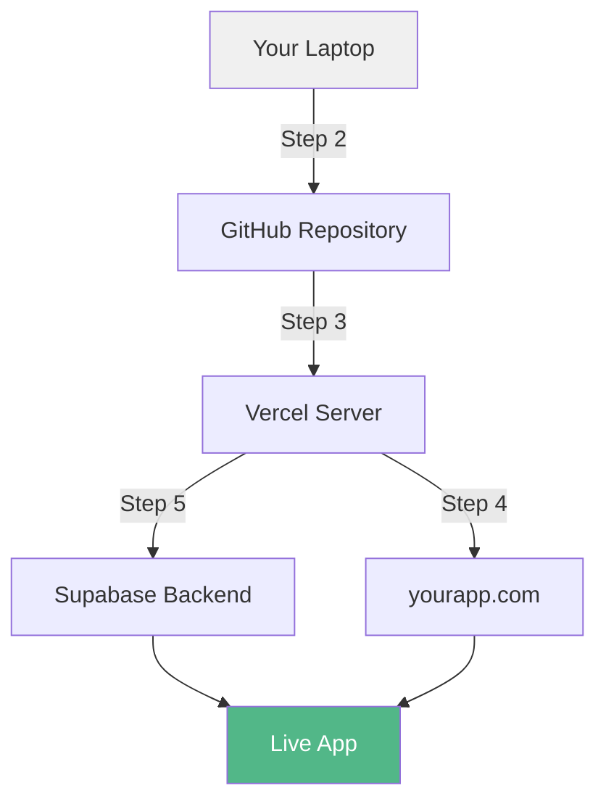
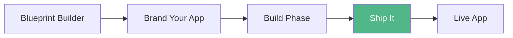

<Info>
**Core System 3 of 3** — A 6-step system to deploy your app with a real URL, real hosting, and (if needed) a real database
</Info>

## What This Does

You built an app. It works on your computer. Now it needs to work on the internet — with a real URL, real hosting, and (if needed) a real database. Ship It takes you from "it works locally" to "here's the link" in 6 progressive steps.

<CardGroup cols={2}>
  <Card title="Without Ship It" icon="laptop">
    - App lives on your laptop forever
    - "I built something" with nothing to show
    - Deployment feels like black magic
    - No idea where to start with hosting
  </Card>
  <Card title="With Ship It" icon="globe">
    - App has a live URL anyone can visit
    - "Here's the link" — proof of work
    - 6 clear steps, each under 15 minutes
    - Free hosting on GitHub Pages or Vercel
  </Card>
</CardGroup>

## The 6 Steps

Each step is a standalone guide. Do them in order. Stop at the step that matches your complexity level.

<Steps>
  <Step title="Step 1: Local Testing" icon="flask">
    **Time:** 15 min
    
    Test your app on your computer before deploying
  </Step>
  
  <Step title="Step 2: GitHub Push" icon="github">
    **Time:** 15 min
    
    Upload your code to GitHub (free cloud storage for code)
  </Step>
  
  <Step title="Step 3: Vercel Deploy" icon="rocket">
    **Time:** 10 min
    
    Deploy to Vercel — your app gets a live URL
  </Step>
  
  <Step title="Step 4: Custom Domain" icon="link">
    **Time:** 20 min
    
    Connect a custom domain (yourapp.com)
  </Step>
  
  <Step title="Step 5: Database Connect" icon="database">
    **Time:** 30 min
    
    Connect Supabase for user accounts and persistent data
  </Step>
  
  <Step title="Step 6: Launch Checklist" icon="clipboard-check">
    **Time:** 20 min
    
    Final QA, security check, and launch
  </Step>
</Steps>

<Note>
**Total time (all 6 steps):** Under 2 hours
</Note>

## Which Steps Do I Need?

Not every app needs all 6 steps. Here's your path by complexity level:

<Tabs>
  <Tab title="Beginner">
    ### Beginner (Single HTML File)
    
    <Steps>
      <Step title="Step 1: Local Testing" />
      <Step title="Step 2: GitHub Push">
        → Deploy via GitHub Pages (covered in Step 2)
        
        <Check>DONE — You have a live URL</Check>
      </Step>
    </Steps>
    
    **Skip Steps 3-6.** GitHub Pages handles hosting for free. No domain or database needed.
  </Tab>
  
  <Tab title="Intermediate">
    ### Intermediate (Multi-File Project)
    
    <Steps>
      <Step title="Step 1: Local Testing" />
      <Step title="Step 2: GitHub Push" />
      <Step title="Step 3: Vercel Deploy" />
      <Step title="Step 4: Custom Domain (optional)">
        <Check>DONE — Professional deployment with fast hosting</Check>
      </Step>
    </Steps>
    
    **Skip Steps 5-6** unless your app uses a database.
  </Tab>
  
  <Tab title="Advanced">
    ### Advanced (Full-Stack with Supabase)
    
    <Steps>
      <Step title="Step 1: Local Testing" />
      <Step title="Step 2: GitHub Push" />
      <Step title="Step 3: Vercel Deploy" />
      <Step title="Step 4: Custom Domain (recommended)" />
      <Step title="Step 5: Database Connect" />
      <Step title="Step 6: Launch Checklist">
        <Check>DONE — Production-grade deployment</Check>
      </Step>
    </Steps>
    
    **Do all 6 steps.** Your app has user accounts and persistent data — it needs proper security checks.
  </Tab>
</Tabs>

## What You Need Before Starting

<CardGroup cols={2}>
  <Card title="GitHub" icon="github">
    **Cost:** Free
    
    **Sign Up:** [github.com](https://github.com)
    
    Stores your code in the cloud
  </Card>
  
  <Card title="Vercel" icon="triangle">
    **Cost:** Free (hobby tier)
    
    **Sign Up:** [vercel.com](https://vercel.com)
    
    Hosts your app with fast global CDN
  </Card>
  
  <Card title="Supabase" icon="database">
    **Cost:** Free (starter tier)
    
    **Sign Up:** [supabase.com](https://supabase.com)
    
    Backend database and authentication
  </Card>
  
  <Card title="Custom Domain" icon="dollar-sign">
    **Cost:** $10-15/year (optional)
    
    **Providers:** Namecheap, Porkbun, Cloudflare
    
    Your own yourapp.com address
  </Card>
</CardGroup>

<Note>
All core tools are free. A custom domain is the only optional cost.
</Note>

## How Deployment Works (The Big Picture)

**Translation:**

1. You write code on your laptop
2. GitHub stores a copy of your code in the cloud
3. Vercel reads your GitHub code and turns it into a live website
4. (Optional) You point a custom domain at your Vercel site
5. (Advanced) Supabase handles user accounts and stores data
6. You run through the launch checklist to make sure everything is solid

## Step-by-Step Guides

Each step has its own detailed guide with:

<CardGroup cols={3}>
  <Card title="Screenshots" icon="image">
    Visual walkthrough of every click
  </Card>
  <Card title="Common Errors" icon="triangle-exclamation">
    Exact error messages and how to fix them
  </Card>
  <Card title="Verification" icon="check">
    How to confirm it worked
  </Card>
</CardGroup>

## Common Questions

<AccordionGroup>
  <Accordion title="Can I skip straight to Step 3?">
    No. Always test locally first (Step 1) and push to GitHub (Step 2) before deploying. Skipping steps creates bugs you can't debug.
  </Accordion>
  
  <Accordion title="Do I need Vercel if I'm using GitHub Pages?">
    Beginner apps (single HTML files) work great on GitHub Pages. Once you have multi-file projects or need server-side features, switch to Vercel.
  </Accordion>
  
  <Accordion title="Is Vercel really free?">
    Yes. The hobby tier is free for personal projects. It includes custom domains, HTTPS, and automatic deployments from GitHub. You only pay if you exceed generous usage limits (most apps never will).
  </Accordion>
  
  <Accordion title="What if my deployment fails?">
    Every step guide includes a "Common Errors" section with the exact error messages you'll see and how to fix them. If you're still stuck, post the error in the Vibe Coding Help channel.
  </Accordion>
  
  <Accordion title="Can I use Netlify instead of Vercel?">
    Yes. The process is nearly identical. These guides use Vercel because it has the smoothest GitHub integration and best free tier for our use case.
  </Accordion>
</AccordionGroup>

## Deployment Checklist

Before you hit "Deploy", verify:

<Checklist>
  <Check>App works locally without errors</Check>
  <Check>All files are committed to Git</Check>
  <Check>No API keys or secrets in the code</Check>
  <Check>Environment variables are properly configured</Check>
  <Check>Mobile responsive (test on phone)</Check>
  <Check>All forms validate input</Check>
  <Check>Error messages are user-friendly</Check>
  <Check>README includes setup instructions</Check>
</Checklist>

## Where This Fits

<CardGroup cols={3}>
  <Card title="Blueprint Builder" icon="wand-magic-sparkles" href="/blueprints/blueprint-builder">
    Generate your app plan
  </Card>
  <Card title="Brand Your App" icon="palette" href="/blueprints/brand-your-app">
    Design direction and colors
  </Card>
  <Card title="Live Classes" icon="video" href="/blueprints/live-classes">
    Ship It Friday sessions
  </Card>
</CardGroup>

## Next Steps

<CardGroup cols={2}>
  <Card title="Start with Step 1" icon="play">
    Test your app locally before deploying
  </Card>
  <Card title="Join Ship It Friday" icon="calendar" href="/blueprints/live-classes">
    Deploy live with the community every Friday
  </Card>
</CardGroup>