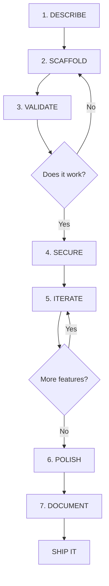

## The Vibe Coding Philosophy

**Vibe Coding** is using AI to build real applications by describing what you want in plain language. Not clicking buttons in a visual builder. Not memorizing syntax. **Describing.** The AI writes real HTML, real CSS, real JavaScript. You direct it.

<Note>
  **The core shift:** You stop asking "how do I code this?" and start asking "how do I describe this clearly enough for AI to build it?"
</Note>

## What Vibe Coding Is NOT

<CardGroup cols={2}>
  <Card title="It's NOT No-Code" icon="xmark" color="#EF4444">
    When you vibe code, you generate actual code that runs in browsers, talks to databases, and gets deployed. Real code. You just didn't type every character yourself.
  </Card>
  <Card title="It's NOT Blindly Copying" icon="xmark" color="#EF4444">
    You need to develop the ability to read what AI generates, understand what it's doing, and guide it when it goes wrong. You don't memorize syntax — you understand intent.
  </Card>
  <Card title="It's NOT a Shortcut" icon="xmark" color="#EF4444">
    Vibe coding is a legitimate development approach. You're trading one skill (syntax memorization) for another (precise description and debugging).
  </Card>
  <Card title="It's NOT For Watchers" icon="xmark" color="#EF4444">
    This is for builders. If you want to collect courses and watch tutorials, this isn't your path. Vibe coding is about shipping.
  </Card>
</CardGroup>

## The Problem Vibe Coding Solves

### Traditional Coding

**Learning curve:** 2-4 years before you can build something real on your own.

**Barriers:**
- Syntax memorization
- Computer science theory
- Debugging cryptic error messages
- Years of practice before shipping anything users actually want

### No-Code Tools

**Learning curve:** Much faster (days to weeks)

**Barriers:**
- Hard ceiling — can't go beyond templates
- Building inside someone else's box
- The moment your idea doesn't fit the tool, you hit a wall
- Limited customization and control

### Vibe Coding

**Learning curve:** Hours to days for first app, weeks to months for mastery

**Advantages:**
- Real code with no ceiling
- Full customization control
- Own your entire stack
- Deploy anywhere
- Scale from simple to complex

<Tip>
  **The gap:** Millions of creative professionals have real, specific ideas for apps their communities need. Traditional coding is too slow. No-code is too limited. Vibe coding removes the implementation bottleneck.
</Tip>

## The Consumer vs. Alchemist Mindset

This is the foundational identity shift:

<Tabs>
  <Tab title="Consumer Mindset">
    ### The Consumer
    
    - ❌ Collects courses
    - ❌ Watches tutorials
    - ❌ Has 47 subscriptions
    - ❌ Hopes for results
    - ❌ Follows trends
    - ❌ Doesn't know their pricing
    - ❌ Scattered across tools
    - ❌ Vague about goals
    - ❌ Consumes content
    - ❌ Spends on courses
    
    **The Pattern:** Passive. Dependent. Collecting information without output.
  </Tab>
  
  <Tab title="Alchemist Mindset">
    ### The Alchemist
    
    - ✅ Builds systems
    - ✅ Creates deliverables
    - ✅ Has intentional stack
    - ✅ Architects outcomes
    - ✅ Designs workflows
    - ✅ Knows their value
    - ✅ Unified in their lab
    - ✅ Clear on deliverables
    - ✅ Creates content
    - ✅ Earns from skills
    
    **The Pattern:** Active. Independent. Creating assets with commercial value.
  </Tab>
</Tabs>

<Warning>
  **This shift is not small.** The ability to ship a working app is a superpower. You're not transitioning from "non-technical" to "technical." You're transitioning from **Consumer to Alchemist**.
</Warning>

## The 7-Step Vibe Coding Workflow

Every app in the Digital Alchemy Vault follows this proven workflow. Master this once, use it forever.

### 1. DESCRIBE

**What am I building? For whom? What's the happy path?**

Before you touch AI, write out what you're building in plain language. Not a spec document. Not wireframes. Three to five clear sentences.

**Example:**
> A calorie counter that lets me log meals by name and calorie amount, shows my running daily total, and compares it against a daily goal I set. It's for someone tracking their diet without wanting a complicated app. The main thing it does is tell me — at a glance — whether I'm over or under my goal for the day.

<Tip>
  **Garbage in, garbage out.** The more specific you are here, the better your scaffold will be. Clarity in your prompt = working code out.
</Tip>

### 2. SCAFFOLD

**Get basic structure working (ugly is fine)**

Take your description and paste it into Google AI Studio. Ask it to build you an HTML file with embedded CSS and JavaScript.

You will get back a working prototype — sometimes on the first try, sometimes after one or two adjustments. It has a form, a list, a running total. It's ugly. The font is wrong. The colors are generic.

**It does not matter. It works. That is a scaffold.**

<Note>
  **Key principle:** Ship ugly, iterate pretty. Do not spend time on design at this stage. A working ugly app is infinitely more useful than a beautiful broken one.
</Note>

### 3. VALIDATE

**Does it actually work? Test it.**

Open your scaffold in a browser and **break it**:

- Click every button
- Enter test data
- Enter bad data (letters where numbers should go, empty fields, etc.)
- Submit the form ten times fast
- Refresh the page — does data persist?

Write down everything that behaves unexpectedly.

<Warning>
  Validation is not optional. It's the difference between a prototype and an app someone can actually use. **Do not move forward** until you know exactly what works and what doesn't.
</Warning>

### 4. SECURE

**Lock it down before adding features**

This is the step most people skip. **Do not skip it.**

For simple apps:
- Make sure there are no API keys hardcoded
- Ensure user input is being handled safely
- Validate and sanitize all inputs

For complex apps (user accounts, databases, payments):
- Implement authentication
- Set up row-level security
- Validate on both client and server
- Use environment variables for secrets
- Enable HTTPS

<Tip>
  **Build the habit now** when the stakes are low. The habit you build treating security as a workflow step (not an afterthought) is what keeps you from shipping exploitable apps later.
</Tip>

### 5. ITERATE

**Add features one at a time**

Your scaffold works. It's secure. Now you make it better. **One feature at a time. Not five features at once — one.**

**Example workflow:**
1. Your calorie counter logs meals and shows a total
2. Add a meal history view → Test it → It works
3. Add a progress bar that fills as you approach your goal → Test it → It works
4. Add ability to edit past entries → Test it → It works

One feature. One test. One commit.

<Note>
  **The chaos of vibe coding comes from trying to build everything at once.** The workflow prevents chaos. Add one thing. Confirm it works. Add the next thing.
</Note>

### 6. POLISH

**UI, UX, error messages**

This is where your app goes from "it works" to "it's professional."

Now you care about design:
- Apply your niche color palette from Brand Your App
- Refine typography and spacing
- Add smooth transitions and animations
- Write clear error messages that help users understand what went wrong
- Make it responsive for all screen sizes
- Add loading states and feedback

**Example:**
The calorie counter gets the Health niche palette — clean greens, neutral backgrounds, clear hierarchy. The total counter gets a color that shifts from green to amber to red as you approach your goal. The form gets a success animation when a meal is logged.

Small things. Big difference.

<Tip>
  **Polish is not vanity.** It's what makes users trust your app and keep coming back. Professional presentation = perceived value.
</Tip>

### 7. DOCUMENT

**Comments, README, teach it back**

The final step is writing comments inside your code that explain what each section does — in plain language, as if you were explaining it to someone learning alongside you.

**Example:**
```javascript
// This function takes the meal name and calorie value,
// adds it to the list, and updates the running total
function addMeal(name, calories) {
  // Implementation here
}
```

If you can write that comment, you understand that code. If you can't write it, you don't understand it yet — and that's important to know.

<Warning>
  **If you can't explain it, you don't understand it yet.** Documentation is not busywork. It is the proof that you learned something.
</Warning>

## The Workflow in Practice

Here's how the 7 steps flow together:



<Note>
  **Every app in this vault follows this workflow. Every single one.** You are not learning 32 different things. You are getting better at one system.
</Note>

## Vibe Coding Principles

### 1. Precision in Prompts is the New Technical Skill

You don't need to memorize `array.prototype.map()` syntax. You need to be able to describe clearly:

> "I need to take this list of meal objects and display each one as a card showing the name, calories, and a delete button."

The AI handles the syntax. You handle the intent.

### 2. Understanding > Memorization

You should be able to:
- Read the code AI generates
- Understand what each section does
- Identify when something is wrong
- Guide the AI to fix issues

You don't need to write it from scratch. You need to **direct it**.

### 3. Ship Fast, Iterate Pretty

A working ugly app beats a beautiful broken one every time.

**Beginner mistake:** Spending 3 hours perfecting colors before validating the app actually works.

**Alchemist approach:** Ship the ugly version, get feedback, iterate based on real usage.

### 4. Security is Non-Negotiable

Even when vibing fast, security is part of the workflow. Not an afterthought. Not optional.

Build apps that are safe to use. Period.

### 5. One Feature at a Time

The #1 cause of vibe coding chaos: trying to add multiple features simultaneously.

**The fix:** Add one thing. Test it. Then add the next thing.

## Common Misconceptions

<AccordionGroup>
  <Accordion title="'This is just copying and pasting code'">
    No. You're directing AI to build custom solutions to your specific problems. The code is generated for YOUR app based on YOUR description. That's not copying — that's architecting.
  </Accordion>
  
  <Accordion title="'Real developers write code from scratch'">
    Real developers solve problems. The tool doesn't matter. If AI can generate boilerplate faster, real developers use AI and focus on the hard problems.
  </Accordion>
  
  <Accordion title="'You won't understand what you're building'">
    That's why DOCUMENT is step 7. If you can't explain what each section does, you're not done. Understanding is part of the workflow.
  </Accordion>
  
  <Accordion title="'AI will just replace developers anyway'">
    AI is a tool. Hammers didn't replace carpenters. Calculators didn't replace mathematicians. AI won't replace builders — it will amplify them.
  </Accordion>
</AccordionGroup>

## The Alchemist Creed

The manifesto that defines the vibe coding mindset:

<Card>
  **I am not a consumer. I am a creator.**
  
  I don't collect courses. I build systems.  
  I don't follow trends. I design workflows.  
  I don't hope for clarity. I architect outcomes.
  
  My stack is intentional.  
  My skills compound.  
  My output has value.
  
  I see synergy where others see silos.  
  I build tools where others buy subscriptions.  
  I monetize skills where others collect certificates.
  
  I am done being vague.  
  I am done being passive.  
  I am done being a follower.
  
  **I am an Alchemist.**
</Card>

## Learning Pathway

<Steps>
  <Step title="Flash Module 01: What Is Vibe Coding?">
    Watch the 15-minute lesson (you're reading the written version now)
  </Step>
  <Step title="Flash Module 02: AI Studio Setup">
    Get Google AI Studio configured and ready
  </Step>
  <Step title="Flash Module 03: Your First Prompt">
    Generate your first piece of real code
  </Step>
  <Step title="Build Your First App">
    Pick a Beginner blueprint and follow the workflow
  </Step>
  <Step title="Deploy It">
    Use Ship It to get your app live on the internet
  </Step>
  <Step title="Repeat & Level Up">
    Build 3-5 Beginner apps, then move to Intermediate
  </Step>
</Steps>

<Tip>
  **You are 5 modules away from having a live app.** Not a concept. Not a demo. A live, deployed app with a URL you can share.
</Tip>

## Resources

<CardGroup cols={2}>
  <Card title="Quickstart Guide" icon="bolt" href="/quickstart">
    Build your first app in under 2 hours
  </Card>
  <Card title="Blueprint Library" icon="folder" href="/blueprints/blueprint-builder">
    32 pre-built app blueprints across 9 niches
  </Card>
  <Card title="100-Day Challenge" icon="calendar" href="/concepts/100-day-challenge">
    Ship 1 app per day methodology
  </Card>
  <Card title="Brand Your App" icon="palette" href="/blueprints/brand-your-app">
    Design systems for all 9 niches
  </Card>
</CardGroup>

---

<Warning>
  **The bottleneck has never been the idea. It's always been the implementation.** Vibe coding removes that bottleneck. Now the only question is: will you build?
</Warning>